# Train Ticket Reservation System

This JavaFX application, created with Maven, is designed to allow users to easily book train tickets across Europe.

## Features

- Login and registration for users
- Connection to database (included dump file in repository)
- CLI for admin users

## User Panel

The user panel provides users with all the information they need to plan their trips, including:

- Information about travel options and destinations
- Information about COVID-19 in Europe
- Information about hotels in Europe

Users can also easily book train tickets and view all of their past bookings.

## Admin Panel

The admin panel provides administrators with a range of tools to manage the system, including:

- The ability to add, edit, and delete train routes
- Information about the number of users the app has
- Information about the profit generated by the app
- A list of all users, train routes, and reservations

## Getting started

To run this app, download a repository and ensure you have installed the following systems:

- Maven
- JDK 19
- JavaFX SDK 19
- MySQL

## Build and run GUI

- Navigate to project and execute command mvn clean install
- Run project with command mvn clean javafx:run

## Build and run CLI

- Navigate to project and execute command mvn clean install -P cli-app
- Run project with command java -jar target/rpr_poject-cli-jar-with-dependencies.jar

## The Screenshots of some webPages of this project are here:

### Login Page
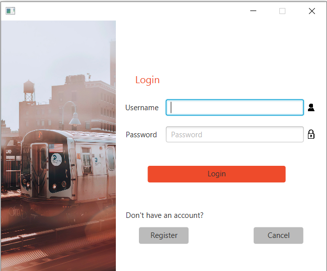

### Registration Page
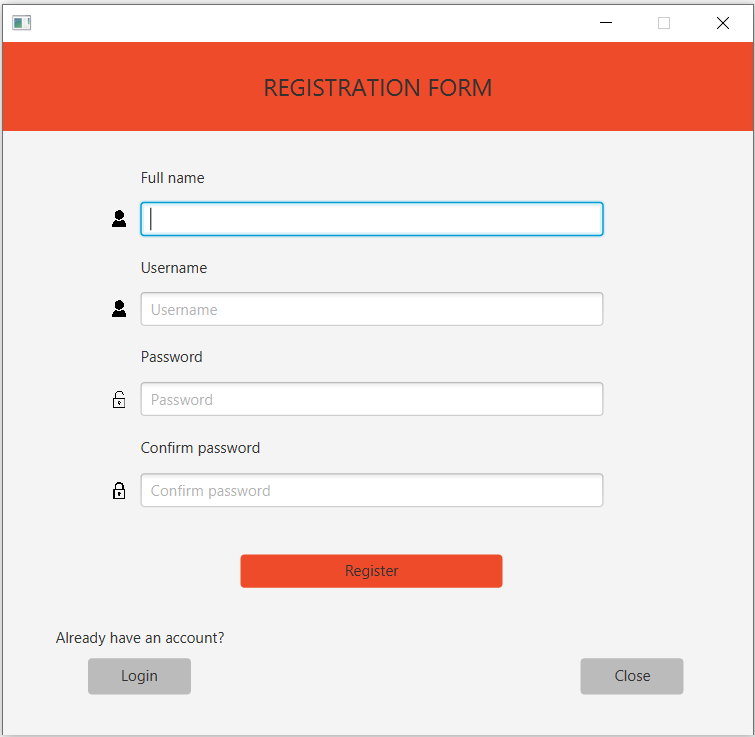

### Admin Home Page
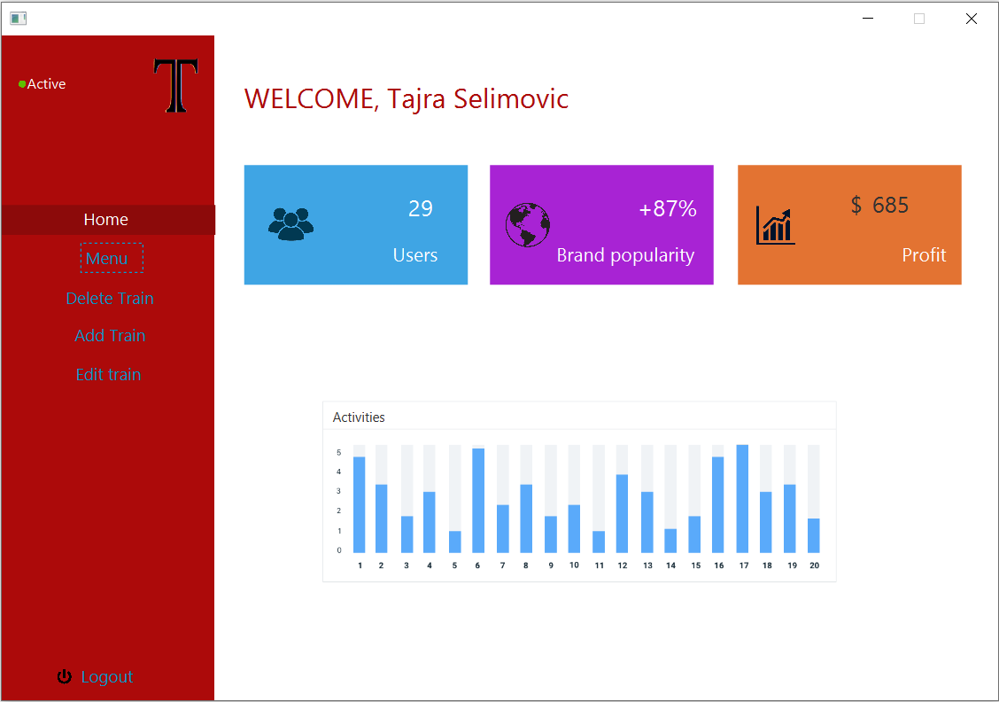

### Admin Menu Page
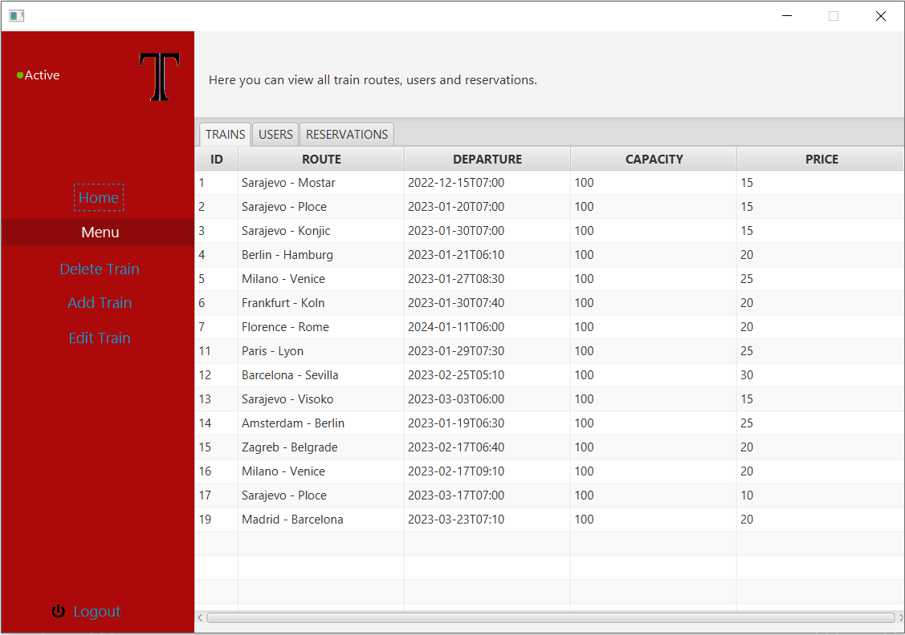

### Admin Delete Page
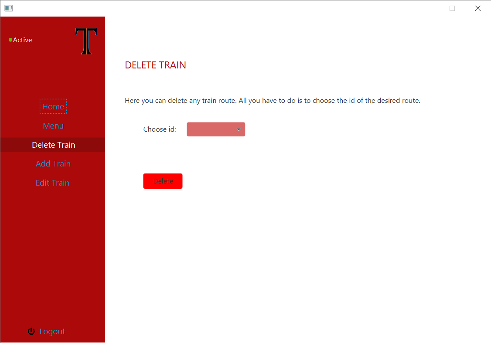

### Admin Add Page
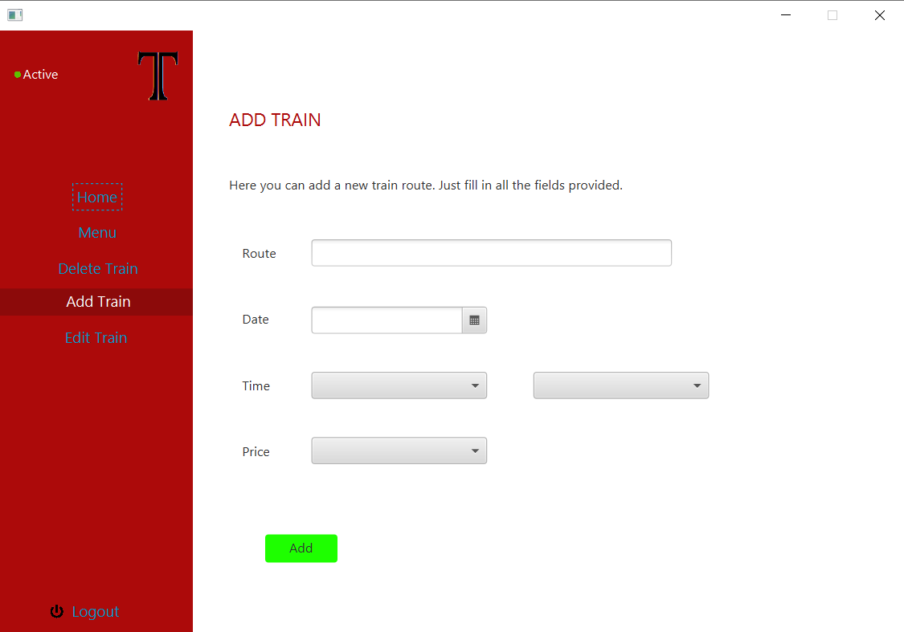

### Admin Edit Page
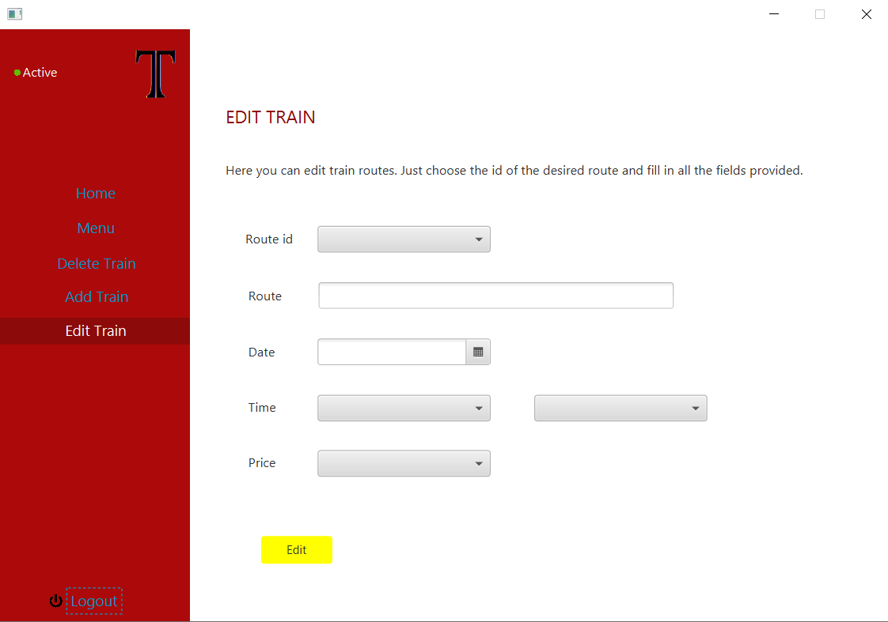

### Admin Delete Page

### User Home Page
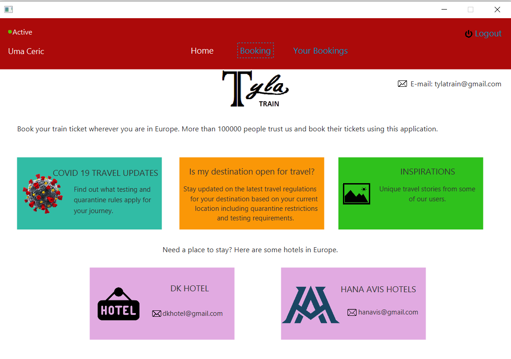

### User Booking Page
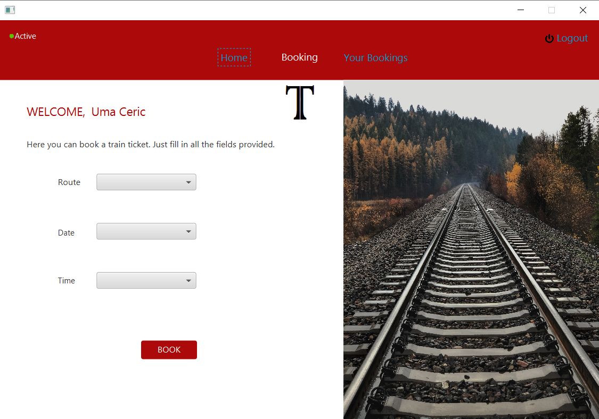

### User Your Bookings Page
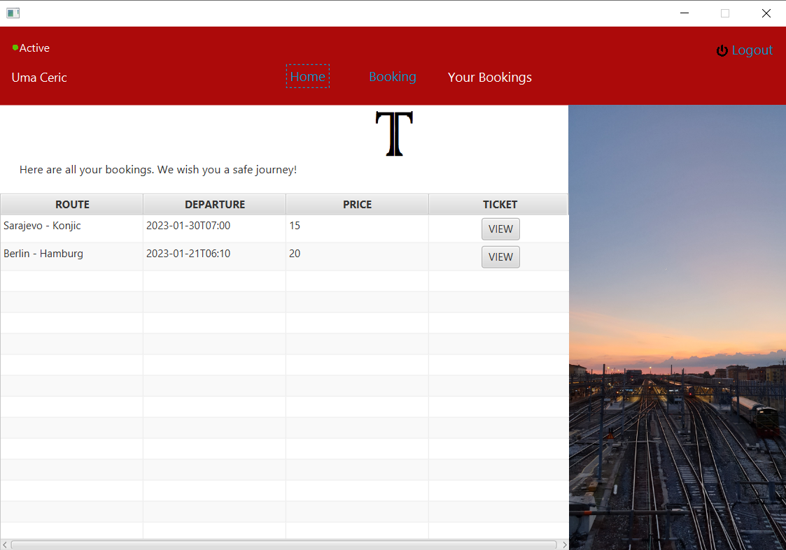

### View Ticket Page
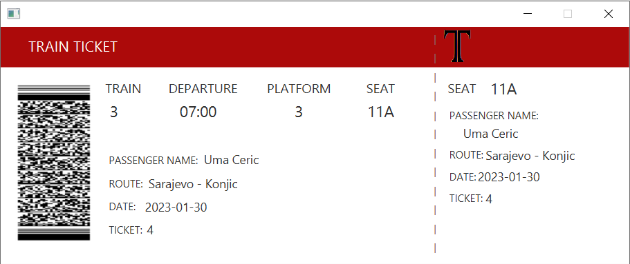